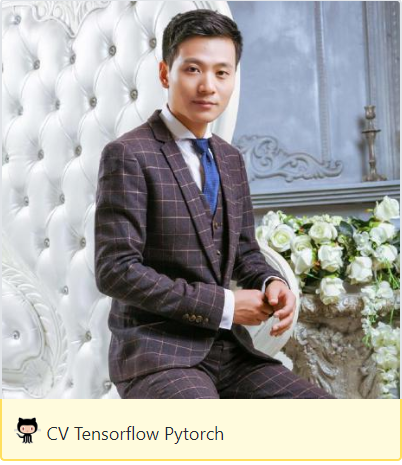

## 关于我
------

**徐静**：（[dataxujing](https://github.com/DataXujing)） 小白一个，AI图像算法研发工程师，数据科学爱好者，喜欢R, Python, C++ 关注机器学习，深度学习等AI领域； 喜欢网络爬虫，关注前端可视化; 对ASR(语音识别)，NLP(自然语言处理)，CV(计算机视觉)均有涉猎； 目前从事医疗影像AI算法的研究和落地工作。

 

> 该教程主要是对另一个大佬的libtorch教程的整理，感谢大佬开源：<https://github.com/AllentDan>

 
 
 
 

 