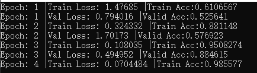

## 第五章 分类模型搭建，训练，预测
------

前面的章节中我们介绍了libtorch的环境搭建，libtorch张量常用操作，简单的MLP，CNN和LSTM模型搭建，以及数据加载类的使用。本章将以图像分类任务为例，详细介绍如何使用c++训练一个图片分类器。

### 1.模型

本文以VGG为例，对比pytorch下的模型搭建和训练，阐述Libtorch的模型搭建，模型加载预训练（from ImageNet）权重。VGG模型是2014年的ImageNet分类冠军，由于后续深度学习的发展，添加了一些成分，如BatchNorm，形成一些新变种。本文以vgg16bn为例作介绍，vgg16bn就是vgg16加上了后续提出的BatchNorm层。

#### 1.分析模型

首先介绍pytorch的模型源码，pytorch的torchvision.models.VGG中有提供官方的VGG模型代码。直接复制上来分析：
```python

class VGG(nn.Module):

    def __init__(self, features, num_classes=1000, init_weights=True):
        super(VGG, self).__init__()
        self.features = features
        self.avgpool = nn.AdaptiveAvgPool2d((7, 7))
        self.classifier = nn.Sequential(
            nn.Linear(512 * 7 * 7, 4096),
            nn.ReLU(True),
            nn.Dropout(),
            nn.Linear(4096, 4096),
            nn.ReLU(True),
            nn.Dropout(),
            nn.Linear(4096, num_classes),
        )
        if init_weights:
            self._initialize_weights()

    def forward(self, x):
        x = self.features(x)
        x = self.avgpool(x)
        x = torch.flatten(x, 1)
        x = self.classifier(x)
        return x

    def _initialize_weights(self):
        for m in self.modules():
            if isinstance(m, nn.Conv2d):
                nn.init.kaiming_normal_(m.weight, mode='fan_out', nonlinearity='relu')
                if m.bias is not None:
                    nn.init.constant_(m.bias, 0)
            elif isinstance(m, nn.BatchNorm2d):
                nn.init.constant_(m.weight, 1)
                nn.init.constant_(m.bias, 0)
            elif isinstance(m, nn.Linear):
                nn.init.normal_(m.weight, 0, 0.01)
                nn.init.constant_(m.bias, 0)

def make_layers(cfg, batch_norm=False):
    layers = []
    in_channels = 3
    for v in cfg:
        if v == 'M':
            layers += [nn.MaxPool2d(kernel_size=2, stride=2)]
        else:
            conv2d = nn.Conv2d(in_channels, v, kernel_size=3, padding=1)
            if batch_norm:
                layers += [conv2d, nn.BatchNorm2d(v), nn.ReLU(inplace=True)]
            else:
                layers += [conv2d, nn.ReLU(inplace=True)]
            in_channels = v
    return nn.Sequential(*layers)

cfgs = {
    'A': [64, 'M', 128, 'M', 256, 256, 'M', 512, 512, 'M', 512, 512, 'M'],
    'B': [64, 64, 'M', 128, 128, 'M', 256, 256, 'M', 512, 512, 'M', 512, 512, 'M'],
    'D': [64, 64, 'M', 128, 128, 'M', 256, 256, 256, 'M', 512, 512, 512, 'M', 512, 512, 512, 'M'],
    'E': [64, 64, 'M', 128, 128, 'M', 256, 256, 256, 256, 'M', 512, 512, 512, 512, 'M', 512, 512, 512, 512, 'M'],
}

def _vgg(arch, cfg, batch_norm, pretrained, progress, **kwargs):
    if pretrained:
        kwargs['init_weights'] = False
    model = VGG(make_layers(cfgs[cfg], batch_norm=batch_norm), **kwargs)
    if pretrained:
        state_dict = load_state_dict_from_url(model_urls[arch],
                                              progress=progress)
        model.load_state_dict(state_dict)
    return model

```

和现在的复杂模型相比，VGG模型结构较为简单，就是简单的多次卷积+下采样堆叠，后接一个三层的MLP。代码中VGG模型类有三个成员函数，一个初始化函数init，一个前向传播函数forward，最后一个权重初始化函数。类外部有一个函数make_layers函数用于生成CNN主干，返回一个nn.Sequential对象。

打开python编辑器（or IDE，默认有pytorch编程经验）。输入下面代码：
```python
from torchvision.models import vgg16,vgg16_bn

model = vgg16_bn(pretrained=True)
for k,v in model.named_parameters():
    print(k)
```

发现打印出模型每一层（有权重的层，不包括类似激活函数层）的名称。
```

features.0.weight
features.0.bias
features.1.weight
features.1.bias
features.3.weight
features.3.bias
features.4.weight
features.4.bias
features.7.weight
features.7.bias
features.8.weight
features.8.bias
features.10.weight
features.10.bias
features.11.weight
features.11.bias
features.14.weight
features.14.bias
features.15.weight
features.15.bias
features.17.weight
features.17.bias
features.18.weight
features.18.bias
features.20.weight
features.20.bias
features.21.weight
features.21.bias
features.24.weight
features.24.bias
features.25.weight
features.25.bias
features.27.weight
features.27.bias
features.28.weight
features.28.bias
features.30.weight
features.30.bias
features.31.weight
features.31.bias
features.34.weight
features.34.bias
features.35.weight
features.35.bias
features.37.weight
features.37.bias
features.38.weight
features.38.bias
features.40.weight
features.40.bias
features.41.weight
features.41.bias
classifier.0.weight
classifier.0.bias
classifier.3.weight
classifier.3.bias
classifier.6.weight
classifier.6.bias


```

还行，不是很长。这步操作对后续模型搭建和加载权重很重要，因为torch的模型加载必须要有一一对应的权重层的名称。如果代码中的模型和加载路径对应的权重提供的权重层名称不一致，就会产生错误。

分析模型打印的名称，其实就会发现只有features，classifier，weight和bias和数字。联系前面的官方代码的初始化函数init，函数内部有self.classifer和self.features，就很容易得出pytorch模型的内部层名称命名规律了。weight和bias对应conv层里的self.conv和self.bias。点和数字表示nn.Sequential里的序号。

### 2.搭建模型

下面在c++中搭建一个和pytorch下完全一致的vgg16bn。如果不一致的话其实不影响正常的模型训练和预测，但是影响初始化状态，模型加载从ImageNet数据集训练好的权重以后，训练收敛的速度和收敛后的精度都会好很多。

首先是.h文件中要做的，一个conv_options确定卷积超参数，因为常用所以inline一下。maxpool_options函数确定MaxPool2d的超参数。如何定义一个和pytorch一致的make_features函数，再在VGG类中声明和pytorch一致的初始化和前向传播函数。最后则是一个vgg16bn函数，返回vgg16bn模型。

```c++
//和前面章节一致，定义一个确定conv超参数的函数
inline torch::nn::Conv2dOptions conv_options(int64_t in_planes, int64_t out_planes, int64_t kerner_size,
    int64_t stride = 1, int64_t padding = 0, bool with_bias = false) {
    torch::nn::Conv2dOptions conv_options = torch::nn::Conv2dOptions(in_planes, out_planes, kerner_size);
    conv_options.stride(stride);
    conv_options.padding(padding);
    conv_options.bias(with_bias);
    return conv_options;
}

//仿照上面的conv_options，定义一个确定MaxPool2d的超参数的函数
inline torch::nn::MaxPool2dOptions maxpool_options(int kernel_size, int stride){
    torch::nn::MaxPool2dOptions maxpool_options(kernel_size);
    maxpool_options.stride(stride);
    return maxpool_options;
}

//对应pytorch中的make_features函数，返回CNN主体，该主体是一个torch::nn::Sequential对象
torch::nn::Sequential make_features(std::vector<int> &cfg, bool batch_norm);

//VGG类的声明，包括初始化和前向传播
class VGGImpl: public torch::nn::Module
{
private:
    torch::nn::Sequential features_{nullptr};
    torch::nn::AdaptiveAvgPool2d avgpool{nullptr};
    torch::nn::Sequential classifier;
public:
    VGGImpl(std::vector<int> &cfg, int num_classes = 1000, bool batch_norm = false);
    torch::Tensor forward(torch::Tensor x);
};
TORCH_MODULE(VGG);

//vgg16bn函数的声明
VGG vgg16bn(int num_classes);
```

然后在.cpp文件中定义好.h文件中的声明。.cpp文件的内容如下：

```c++

// make_features 方法
torch::nn::Sequential make_features(std::vector<int> &cfg, bool batch_norm){
    torch::nn::Sequential features;  // 声明 nn.sequential 对象
    int in_channels = 3;             //声明 int对象
    for(auto v : cfg){  //vector的遍历(C++标准模板库)
        if(v==-1){
            features->push_back(torch::nn::MaxPool2d(maxpool_options(2,2)));
        }
        else{
            auto conv2d = torch::nn::Conv2d(conv_options(in_channels,v,3,1,1));
            features->push_back(conv2d);
            if(batch_norm){
                features->push_back(torch::nn::BatchNorm2d(torch::nn::BatchNorm2dOptions(v)));
            }
            features->push_back(torch::nn::ReLU(torch::nn::ReLUOptions(true)));
            in_channels = v;
        }
    }
    return features;
}

VGGImpl::VGGImpl(std::vector<int> &cfg, int num_classes, bool batch_norm){
    features_ = make_features(cfg,batch_norm);
    avgpool = torch::nn::AdaptiveAvgPool2d(torch::nn::AdaptiveAvgPool2dOptions(7));
    classifier->push_back(torch::nn::Linear(torch::nn::LinearOptions(512 * 7 * 7, 4096)));
    classifier->push_back(torch::nn::ReLU(torch::nn::ReLUOptions(true)));
    classifier->push_back(torch::nn::Dropout());
    classifier->push_back(torch::nn::Linear(torch::nn::LinearOptions(4096, 4096)));
    classifier->push_back(torch::nn::ReLU(torch::nn::ReLUOptions(true)));
    classifier->push_back(torch::nn::Dropout());
    classifier->push_back(torch::nn::Linear(torch::nn::LinearOptions(4096, num_classes)));

    features_ = register_module("features",features_);
    classifier = register_module("classifier",classifier);
}

torch::Tensor VGGImpl::forward(torch::Tensor x){
    x = features_->forward(x);
    x = avgpool(x);
    x = torch::flatten(x,1);
    x = classifier->forward(x);
    return torch::log_softmax(x, 1);
}

VGG vgg16bn(int num_classes){
    std::vector<int> cfg_dd = {64, 64, -1, 128, 128, -1, 256, 256, 256, -1, 512, 512, 512, -1, 512, 512, 512, -1};
    VGG vgg = VGG(cfg_dd,num_classes,true);
    return vgg;
}


```

由于c++中元组如果太长的话声明也会很长，而列表或者vector只接受同类型的数据，就将原来pytorch中的cfg里的’M’改成-1。在读取cfg时判断由原来的’M’变成判断是否-1即可。

需要注意的是，给模型不同层命名时，代码里只出现了register_module对features和classifier命名，这和pytorch保持一致。

### 3.使用预训练的权重

下面查看我们c++定义的模型是否和pytorch完全一致。在主函数中实例化一个VGG的对象，然后打印各个层的名称，代码如下：

```c++
std::vector<int> cfg_16bn = {64, 64, -1, 128, 128, -1, 256, 256, 256, -1, 512, 512, 512, -1, 512, 512, 512, -1};

auto vgg16bn = VGG(cfg_16bn,1000,true);
auto dict16bn = vgg16bn->named_parameters();  //vector
for (auto n = dict16bn.begin(); n != dict16bn.end(); n++)
{
    std::cout<<(*n).key()<<std::endl;
}
```

可以发现，各个层名称和pytorch中的模型内部层的名称完全一致。这样我们将pytorch的模型权重保存下来，然后加载到c++中。

```python
import torch
from torchvision.models import vgg16,vgg16_bn

model=model.to(torch.device("cpu"))
model.eval()
var=torch.ones((1,3,224,224))
traced_script_module = torch.jit.trace(model, var)  # torchscript model
traced_script_module.save("vgg16bn.pt")
```

这样，模型的卷积层，归一化层，线性层的权重就保存到.pt文件中了。下面尝试加载到c++中。c++中的加载代码较为简单，直接在定义好的vgg16bn模型后面加载试试：

```c++
std::vector<int> cfg_16bn = {64, 64, -1, 128, 128, -1, 256, 256, 256, -1, 512, 512, 512, -1, 512, 512, 512, -1};
auto vgg16bn = VGG(cfg_16bn,1000,true);

torch::load(vgg16bn,"your path to vgg16bn.pt");
```

正常运行过了一般就代表模型已经成功加载了。


### 4.数据加载

和第四章一样，本章还是使用pytorch官网提供的昆虫分类数据集。下载解压后有train和val文件夹，里面分别有两类昆虫图片。数据加载模块代码和上一章一致，就不重复了。

### 5.封装

1.声明

解决了基本的模型定义和加载，数据加载等问题，下面就可以定义一个Classifier类了。这个类的功能主要有：

+ 初始化：在初始化中完成模型挂载，是cpu还是某个gpu；定义好分类器并加载预训练的权重，实现更好更快训练。
+ 训练：可以指定分类器训练的周期数，训练的batch_size，学习率以及模型保存的路径。
+ 预测：传入图片就可以返回分类器预测的类别。
+ 加载权重。

类的声明很简单：

```c++

class Classifier
{
private:
    torch::Device device = torch::Device(torch::kCPU);  //kCUDA: device = torch::Device(torch::kCUDA,0)
    VGG vgg = VGG{nullptr};
public:
    Classifier(int gpu_id = 0);
    void Initialize(int num_classes, std::string pretrained_path);
    void Train(int epochs, int batch_size, float learning_rate, std::string train_val_dir, std::string image_type, std::string save_path);
    int Predict(cv::Mat &image);
    void LoadWeight(std::string weight);
};


```

2.定义

类的成员函数定义较为复杂：

```c++
void Classifier::LoadWeight(std::string weight){
    torch::load(vgg,weight);
    vgg->eval();
    return;
}
```
LoadWeight没太多要讲的，很简单的加载模型并置为eval()。需要注意的是初始化和训练函数，初始化函数由于模型最后一层的num_class不定，所以不能直接加载之前保存的权重。而训练函数要分别用train和val，并且要注意损失设置等。


3.初始化(构造函数)

首先是初始化函数，初始化函数首先先定义一个num_class对应的分类器vgg16bn，然后定义一个num_class=1000的vgg16bn。加载时加载后者，然后将权重拷贝至前者中。拷贝过程非常精华，需要读者细细揣摩。除了拷贝参数，初始化还会定义好加载到gpu_id对应的GPU上，或者设置gpu_id小于0加载到cpu上。

```c++
Classifier::Classifier(int gpu_id)
{
    if (gpu_id >= 0) {
        device = torch::Device(torch::kCUDA, gpu_id);
    }
    else {
        device = torch::Device(torch::kCPU);
    }
}

void Classifier::Initialize(int _num_classes, std::string _pretrained_path){
    std::vector<int> cfg_d = {64, 64, -1, 128, 128, -1, 256, 256, 256, -1, 512, 512, 512, -1, 512, 512, 512, -1};
    auto net_pretrained = VGG(cfg_d,1000,true);
    vgg = VGG(cfg_d,_num_classes,true);
    torch::load(net_pretrained, _pretrained_path);
    torch::OrderedDict<std::string, at::Tensor> pretrained_dict = net_pretrained->named_parameters();
    torch::OrderedDict<std::string, at::Tensor> model_dict = vgg->named_parameters();

    for (auto n = pretrained_dict.begin(); n != pretrained_dict.end(); n++)
    {
        if (strstr((*n).key().data(), "classifier")) {
            continue;
        }
        model_dict[(*n).key()] = (*n).value();
    }

    torch::autograd::GradMode::set_enabled(false);  // 使参数可以拷贝
    auto new_params = model_dict; 
    auto params = vgg->named_parameters(true );
    auto buffers = vgg->named_buffers(true);
    for (auto& val : new_params) {
        auto name = val.key();
        auto* t = params.find(name);
        if (t != nullptr) {
            t->copy_(val.value());
        }
        else {
            t = buffers.find(name);
            if (t != nullptr) {
                t->copy_(val.value());
            }
        }
    }
    torch::autograd::GradMode::set_enabled(true);
    try
    {
        vgg->to(device);
    }
    catch (const std::exception&e)
    {
        std::cout << e.what() << std::endl;
    }

    return;
}
```

4.训练

然后是训练函数，训练函数分别使用train_loader和val_loader，前者加载train文件夹下的图片训练，后者用于评估。训练过程定义好优化器，损失函数等。

```c++

void Classifier::Train(int num_epochs, int batch_size, float learning_rate, std::string train_val_dir, std::string image_type, std::string save_path){
    std::string path_train = train_val_dir+ "\\train";
    std::string path_val = train_val_dir + "\\val";

    auto custom_dataset_train = dataSetClc(path_train, image_type).map(torch::data::transforms::Stack<>());
    auto custom_dataset_val = dataSetClc(path_val, image_type).map(torch::data::transforms::Stack<>());

    auto data_loader_train = torch::data::make_data_loader<torch::data::samplers::RandomSampler>(std::move(custom_dataset_train), batch_size);
    auto data_loader_val = torch::data::make_data_loader<torch::data::samplers::RandomSampler>(std::move(custom_dataset_val), batch_size);

    float loss_train = 0; float loss_val = 0;
    float acc_train = 0.0; float acc_val = 0.0; float best_acc = 0.0;
    for (size_t epoch = 1; epoch <= num_epochs; ++epoch) {
        size_t batch_index_train = 0;
        size_t batch_index_val = 0;
        if (epoch == int(num_epochs / 2)) { learning_rate /= 10; }
        torch::optim::Adam optimizer(vgg->parameters(), learning_rate); // 学习率
        if (epoch < int(num_epochs / 8))
        {
            for (auto mm : vgg->named_parameters())
            {
                if (strstr(mm.key().data(), "classifier"))
                {
                    mm.value().set_requires_grad(true);
                }
                else
                {
                    mm.value().set_requires_grad(false);
                }
            }
        }
        else {
            for (auto mm : vgg->named_parameters())
            {
                mm.value().set_requires_grad(true);
            }
        }
        // 遍历data_loader，产生批次
        for (auto& batch : *data_loader_train) {
            auto data = batch.data;
            auto target = batch.target.squeeze();
            data = data.to(torch::kF32).to(device).div(255.0);
            target = target.to(torch::kInt64).to(device);
            optimizer.zero_grad();
            // Execute the model
            torch::Tensor prediction = vgg->forward(data);
            auto acc = prediction.argmax(1).eq(target).sum();
            acc_train += acc.template item<float>() / batch_size;
            // 计算损失大小
            torch::Tensor loss = torch::nll_loss(prediction, target);
            // 计算梯度
            loss.backward();
            // 更新权重
            optimizer.step();
            loss_train += loss.item<float>();
            batch_index_train++;
            std::cout << "Epoch: " << epoch << " |Train Loss: " << loss_train / batch_index_train << " |Train Acc:" << acc_train / batch_index_train << "\r";
        }
        std::cout << std::endl;

        //验证
        vgg->eval();
        for (auto& batch : *data_loader_val) {
            auto data = batch.data;
            auto target = batch.target.squeeze();
            data = data.to(torch::kF32).to(device).div(255.0);
            target = target.to(torch::kInt64).to(device);
            torch::Tensor prediction = vgg->forward(data);
            // 计算损失,NLL和Log_softmax配合形成交叉熵损失
            torch::Tensor loss = torch::nll_loss(prediction, target);
            auto acc = prediction.argmax(1).eq(target).sum();
            acc_val += acc.template item<float>() / batch_size;
            loss_val += loss.item<float>();
            batch_index_val++;
            std::cout << "Epoch: " << epoch << " |Val Loss: " << loss_val / batch_index_val << " |Valid Acc:" << acc_val / batch_index_val << "\r";
        }
        std::cout << std::endl;


        if (acc_val > best_acc) {
            torch::save(vgg, save_path);
            best_acc = acc_val;
        }
        loss_train = 0; loss_val = 0; acc_train = 0; acc_val = 0; batch_index_train = 0; batch_index_val = 0;
    }
}

```

5.预测

最后是预测，返回类别ans，中间计算置信度prob。

```c++

int Classifier::Predict(cv::Mat& image){
    cv::resize(image, image, cv::Size(448, 448));
    torch::Tensor img_tensor = torch::from_blob(image.data, { image.rows, image.cols, 3 }, torch::kByte).permute({ 2, 0, 1 });
    img_tensor = img_tensor.to(device).unsqueeze(0).to(torch::kF32).div(255.0);
    auto prediction = vgg->forward(img_tensor);
    prediction = torch::softmax(prediction,1);
    auto class_id = prediction.argmax(1);
    int ans = int(class_id.item().toInt());
    float prob = prediction[0][ans].item().toFloat();
    return ans;
}

```

末尾贴一个训练时的图：
<div align=center>
 
</div>
<br>

训练时的参数设置如下：

```c++

std::string vgg_path = "your path to vgg16_bn.pt";
std::string train_val_dir = "your path to hymenoptera_data";
Classifier classifier(0);
classifier.Initialize(2,vgg_path);
classifier.Train(300,4,0.0003,train_val_dir,".jpg","classifer.pt");

```

其实，周期数设置300时，前面很多个周期都在做固定CNN的迁移学习(or finetune)。可以设置小一些查看直接训练全部模型会怎样，以及思考为何会这样。

至此，libtorch初级教程已经完成，坑很多，作者已经为你踩好，更高级的部分在准备中。

感谢大佬开源：<https://github.com/AllentDan/LibtorchTutorials/tree/main/lesson5-TrainingVGG>