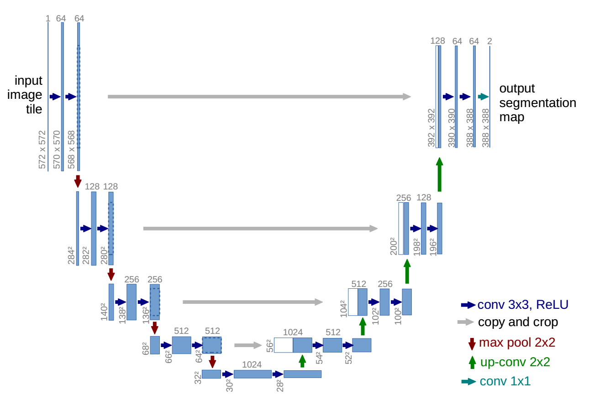

## 第六章 分割模型搭建，训练，预测
------

本章简要介绍如何如何用C++实现一个语义分割器模型，该模型具有训练和预测的功能。本文的分割模型架构使用简单的U-Net结构，代码结构参考了[qubvel segmentation](https://github.com/qubvel/segmentation_models.pytorch)中的U-Net部分，该项目简称SMP，是基于pytorch实现的开源语义分割项目。本文分享的c++模型几乎完美复现了python的版本。

### 1.模型简介

简单介绍一下U-Net模型。U-Net模型的提出是在医学图像分割中，相比于当时的其他模型结构，U-Net的分割能力具有明显优势。一个经典的U-Net结构图如下：

<div align=center>
 
</div>
<br>

U-Net模型采用典型的编码器-解码器结构，左边的编码部分类似VGG模型，是双卷积+下采样的多次堆叠。U-Net模型右边的解码部分同样是双卷积，但是为了得到接近原始输入图像大小的输出图像，针对编码的下采样实施了对应的上采样。最重要的是，U-Net之所以效果突出，重要原因在于其在解码部分利用了编码环节的特征图，拼接编码和解码的特征图，再对拼接后特征图卷积上采样，重复多次得到解码输出。

### 2.编码器—ResNet

本文介绍的编码器使用ResNet网络，同时可以像第五章一样加载预训练权重，即骨干网络为ImageNet预训练的ResNet。话不多说，直接上c++的ResNet代码。

1.Block搭建

建议看本文代码时打开pytorch的torchvision中的resnet.py，对比阅读。

首先是基础模块，pytorch针对resnet18，resne34和resnet50，resnet101，resnet152进行分类，resnet18与resnet34均使用BasicBlock，而更深的网络使用BottleNeck。我不想使用模板类编程，就直接将两个模块合为一体。声明如下：

```c++
class BlockImpl : public torch::nn::Module {
public:
    BlockImpl(int64_t inplanes, int64_t planes, int64_t stride_ = 1,
        torch::nn::Sequential downsample_ = nullptr, int groups = 1, int base_width = 64, bool is_basic = true);
    torch::Tensor forward(torch::Tensor x);
    torch::nn::Sequential downsample{ nullptr };
private:
    bool is_basic = true;
    int64_t stride = 1;
    torch::nn::Conv2d conv1{ nullptr };
    torch::nn::BatchNorm2d bn1{ nullptr };
    torch::nn::Conv2d conv2{ nullptr };
    torch::nn::BatchNorm2d bn2{ nullptr };
    torch::nn::Conv2d conv3{ nullptr };
    torch::nn::BatchNorm2d bn3{ nullptr };
};
TORCH_MODULE(Block);
```

可以发现，其实是直接声明了三个conv结构和一个is_basic标志位判断定义时进行BasicBlock定义还是BottleNeck定义。下面是其定义:

```c++

// 构造函数的实现
BlockImpl::BlockImpl(int64_t inplanes, int64_t planes, int64_t stride_,
    torch::nn::Sequential downsample_, int groups, int base_width, bool _is_basic)
{
    downsample = downsample_;
    stride = stride_;
    int width = int(planes * (base_width / 64.)) * groups;

    conv1 = torch::nn::Conv2d(conv_options(inplanes, width, 3, stride_, 1, groups, false));
    bn1 = torch::nn::BatchNorm2d(torch::nn::BatchNorm2dOptions(width));
    conv2 = torch::nn::Conv2d(conv_options(width, width, 3, 1, 1, groups, false));
    bn2 = torch::nn::BatchNorm2d(torch::nn::BatchNorm2dOptions(width));
    is_basic = _is_basic;
    if (!is_basic) {
        conv1 = torch::nn::Conv2d(conv_options(inplanes, width, 1, 1, 0, 1, false));
        conv2 = torch::nn::Conv2d(conv_options(width, width, 3, stride_, 1, groups, false));
        conv3 = torch::nn::Conv2d(conv_options(width, planes * 4, 1, 1, 0, 1, false));
        bn3 = torch::nn::BatchNorm2d(torch::nn::BatchNorm2dOptions(planes * 4));
    }

    register_module("conv1", conv1);
    register_module("bn1", bn1);
    register_module("conv2", conv2);
    register_module("bn2", bn2);
    if (!is_basic) {
        register_module("conv3", conv3);
        register_module("bn3", bn3);
    }

    if (!downsample->is_empty()) {
        register_module("downsample", downsample);
    }
}

torch::Tensor BlockImpl::forward(torch::Tensor x) {
    torch::Tensor residual = x.clone();

    x = conv1->forward(x);
    x = bn1->forward(x);
    x = torch::relu(x);

    x = conv2->forward(x);
    x = bn2->forward(x);

    if (!is_basic) {
        x = torch::relu(x);
        x = conv3->forward(x);
        x = bn3->forward(x);
    }

    if (!downsample->is_empty()) {
        residual = downsample->forward(residual);
    }

    x += residual;
    x = torch::relu(x);

    return x;
}

```

然后不要忘了熟悉的conv_options函数，定义如下：

```c++
inline torch::nn::Conv2dOptions conv_options(int64_t in_planes, int64_t out_planes, int64_t kerner_size,
    int64_t stride = 1, int64_t padding = 0, int groups = 1, bool with_bias = true) {
    torch::nn::Conv2dOptions conv_options = torch::nn::Conv2dOptions(in_planes, out_planes, kerner_size);
    conv_options.stride(stride);
    conv_options.padding(padding);
    conv_options.bias(with_bias);
    conv_options.groups(groups);
    return conv_options;
}

```

和之前章节中的相比，增加了groups参数，同时with_bias默认打开，使用需要注意修改。

2.ResNet主体搭建

定义好Block模块后就可以设计ResNet了，c++中ResNet模型声明类似pytorch中的ResNet。但是初始化参数增加一个model_type，辅助判断采用哪种Block。

```c++
class ResNetImpl : public torch::nn::Module {
public:
    ResNetImpl(std::vector<int> layers, int num_classes = 1000, std::string model_type = "resnet18",
        int groups = 1, int width_per_group = 64);
    torch::Tensor forward(torch::Tensor x);
    std::vector<torch::Tensor> features(torch::Tensor x);
    torch::nn::Sequential _make_layer(int64_t planes, int64_t blocks, int64_t stride = 1);

private:
    int expansion = 1; bool is_basic = true;
    int64_t inplanes = 64; int groups = 1; int base_width = 64;
    torch::nn::Conv2d conv1{ nullptr };
    torch::nn::BatchNorm2d bn1{ nullptr };
    torch::nn::Sequential layer1{ nullptr };
    torch::nn::Sequential layer2{ nullptr };
    torch::nn::Sequential layer3{ nullptr };
    torch::nn::Sequential layer4{ nullptr };
    torch::nn::Linear fc{nullptr};
};
TORCH_MODULE(ResNet);
```

在实现初始化函数之前，需要实现_make_layer函数。实现好_make_layer函数后再实现ResNet初始化函数，代码如下：

```c++
torch::nn::Sequential ResNetImpl::_make_layer(int64_t planes, int64_t blocks, int64_t stride) {

    torch::nn::Sequential downsample;
    if (stride != 1 || inplanes != planes * expansion) {
        downsample = torch::nn::Sequential(
            torch::nn::Conv2d(conv_options(inplanes, planes *  expansion, 1, stride, 0, 1, false)),
            torch::nn::BatchNorm2d(planes *  expansion)
        );
    }
    torch::nn::Sequential layers;
    layers->push_back(Block(inplanes, planes, stride, downsample, groups, base_width, is_basic));
    inplanes = planes *  expansion;
    for (int64_t i = 1; i < blocks; i++) {
        layers->push_back(Block(inplanes, planes, 1, torch::nn::Sequential(), groups, base_width,is_basic));
    }

    return layers;
}

ResNetImpl::ResNetImpl(std::vector<int> layers, int num_classes, std::string model_type, int _groups, int _width_per_group)
{
    if (model_type != "resnet18" && model_type != "resnet34")
    {
        expansion = 4;
        is_basic = false;
    }
    groups = _groups;
    base_width = _width_per_group;
    conv1 = torch::nn::Conv2d(conv_options(3, 64, 7, 2, 3, 1, false));
    bn1 = torch::nn::BatchNorm2d(torch::nn::BatchNorm2dOptions(64));
    layer1 = torch::nn::Sequential(_make_layer(64, layers[0]));
    layer2 = torch::nn::Sequential(_make_layer(128, layers[1], 2));
    layer3 = torch::nn::Sequential(_make_layer(256, layers[2], 2));
    layer4 = torch::nn::Sequential(_make_layer(512, layers[3], 2));

    fc = torch::nn::Linear(512 * expansion, num_classes);
    register_module("conv1", conv1);
    register_module("bn1", bn1);
    register_module("layer1", layer1);
    register_module("layer2", layer2);
    register_module("layer3", layer3);
    register_module("layer4", layer4);
    register_module("fc", fc);
}
```

3.前向传播及特征提取

前向传播相对简单，直接根据定义好的层往下传播即可。

```c++

// 实现ResNetImpl的forward的成员方法
torch::Tensor  ResNetImpl::forward(torch::Tensor x) {
    x = conv1->forward(x);
    x = bn1->forward(x);
    x = torch::relu(x);
    x = torch::max_pool2d(x, 3, 2, 1);

    x = layer1->forward(x);
    x = layer2->forward(x);
    x = layer3->forward(x);
    x = layer4->forward(x);

    x = torch::avg_pool2d(x, 7, 1);
    x = x.view({ x.sizes()[0], -1 });
    x = fc->forward(x);

    return torch::log_softmax(x, 1);
}

```

但是本文是介绍分割用的，所以需要对不同的特征层进行提取，存储到`std::vector<torch::Tensor>`中。

```c++
std::vector<torch::Tensor> ResNetImpl::features(torch::Tensor x){
    std::vector<torch::Tensor> features;
    features.push_back(x);  //push_back 存放数据
    x = conv1->forward(x);
    x = bn1->forward(x);
    x = torch::relu(x);

    features.push_back(x);
    x = torch::max_pool2d(x, 3, 2, 1);

    x = layer1->forward(x);

    features.push_back(x);
    x = layer2->forward(x);

    features.push_back(x);
    x = layer3->forward(x);

    features.push_back(x);
    x = layer4->forward(x);

    features.push_back(x);

    return features;
}
```

### 3.U-Net解码

上面的ResNet部分其实可以开单章详细讲解，但是参照源码读者应该容易理解，就直接放一起。如果上面的内容是对torchvision在libtorch中的优化，下面的部分可以看成直接对SMP中U-Net解码的c++复制。

直接上声明：

```c++
//.h中的内容
//attention and basic
class SCSEModuleImpl: public torch::nn::Module{
public:
    SCSEModuleImpl(int in_channels, int reduction=16, bool use_attention = false);
    torch::Tensor forward(torch::Tensor x);
private:
    bool use_attention = false;
    torch::nn::Sequential cSE{nullptr};
    torch::nn::Sequential sSE{nullptr};
};TORCH_MODULE(SCSEModule);

class Conv2dReLUImpl: public torch::nn::Module{
public:
    Conv2dReLUImpl(int in_channels, int out_channels, int kernel_size = 3, int padding = 1);
    torch::Tensor forward(torch::Tensor x);
private:
    torch::nn::Conv2d conv2d{nullptr};
    torch::nn::BatchNorm2d bn{nullptr};
};TORCH_MODULE(Conv2dReLU);

//decoderblock and center block
class DecoderBlockImpl: public torch::nn::Module{
public:
    DecoderBlockImpl(int in_channels, int skip_channels, int out_channels, bool skip = true, bool attention = false);
    torch::Tensor forward(torch::Tensor x, torch::Tensor skip);
private:
    Conv2dReLU conv1{nullptr};
    Conv2dReLU conv2{nullptr};
    SCSEModule attention1{nullptr};
    SCSEModule attention2{nullptr};
    torch::nn::Upsample upsample{nullptr};
    bool is_skip = true;
};TORCH_MODULE(DecoderBlock);

torch::nn::Sequential CenterBlock(int in_channels, int out_channels);

class UNetDecoderImpl:public torch::nn::Module
{
public:
    UNetDecoderImpl(std::vector<int> encoder_channels, std::vector<int> decoder_channels, int n_blocks = 5,
                bool use_attention = false, bool use_center=false);
    torch::Tensor forward(std::vector<torch::Tensor> features);
private:
    torch::nn::Sequential center{nullptr};
    torch::nn::ModuleList blocks = torch::nn::ModuleList();
};TORCH_MODULE(UNetDecoder);

#endif // UNETDECODER_H


```

直接上定义：

```c++

// 声明的类中的方法的实现
SCSEModuleImpl::SCSEModuleImpl(int in_channels, int reduction, bool _use_attention){
    use_attention = _use_attention;
    cSE = torch::nn::Sequential(
            torch::nn::AdaptiveAvgPool2d(torch::nn::AdaptiveAvgPool2dOptions(1)),
            torch::nn::Conv2d(conv_options(in_channels, in_channels / reduction, 1)),
            torch::nn::ReLU(torch::nn::ReLUOptions(true)),
            torch::nn::Conv2d(conv_options(in_channels / reduction, in_channels, 1)),
            torch::nn::Sigmoid());
    sSE = torch::nn::Sequential(torch::nn::Conv2d(conv_options(in_channels, 1, 1)), torch::nn::Sigmoid());
    register_module("cSE",cSE);
    register_module("sSE",sSE);
}

torch::Tensor SCSEModuleImpl::forward(torch::Tensor x){
    if(!use_attention) return x;
    return x * cSE->forward(x) + x * sSE->forward(x);
}

Conv2dReLUImpl::Conv2dReLUImpl(int in_channels, int out_channels, int kernel_size, int padding){
    conv2d = torch::nn::Conv2d(conv_options(in_channels,out_channels,kernel_size,1,padding));
    bn = torch::nn::BatchNorm2d(torch::nn::BatchNorm2dOptions(out_channels));
    register_module("conv2d", conv2d);
    register_module("bn", bn);
}

torch::Tensor Conv2dReLUImpl::forward(torch::Tensor x){
    x = conv2d->forward(x);
    x = bn->forward(x);
    return x;
}

DecoderBlockImpl::DecoderBlockImpl(int in_channels, int skip_channels, int out_channels, bool skip, bool attention){
    conv1 = Conv2dReLU(in_channels + skip_channels, out_channels, 3, 1);
    conv2 = Conv2dReLU(out_channels, out_channels, 3, 1);
    register_module("conv1", conv1);
    register_module("conv2", conv2);
    upsample = torch::nn::Upsample(torch::nn::UpsampleOptions().scale_factor(std::vector<double>({2,2})).mode(torch::kNearest));

    attention1 = SCSEModule(in_channels + skip_channels, 16, attention);
    attention2 = SCSEModule(out_channels, 16, attention);
    register_module("attention1", attention1);
    register_module("attention2", attention2);
    is_skip = skip;
}

torch::Tensor DecoderBlockImpl::forward(torch::Tensor x, torch::Tensor skip){
    x = upsample->forward(x);
    if (is_skip){
        x = torch::cat({x, skip}, 1);
        x = attention1->forward(x);
    }
    x = conv1->forward(x);
    x = conv2->forward(x);
    x = attention2->forward(x);
    return x;
}

torch::nn::Sequential CenterBlock(int in_channels, int out_channels){
    return torch::nn::Sequential(Conv2dReLU(in_channels, out_channels, 3, 1),
                                 Conv2dReLU(out_channels, out_channels, 3, 1));
}

UNetDecoderImpl::UNetDecoderImpl(std::vector<int> encoder_channels, std::vector<int> decoder_channels, int n_blocks,
                         bool use_attention, bool use_center)
{
    if (n_blocks != decoder_channels.size()) throw "Model depth not equal to your provided `decoder_channels`";
    std::reverse(std::begin(encoder_channels),std::end(encoder_channels));

    // computing blocks input and output channels
    int head_channels = encoder_channels[0];
    std::vector<int> out_channels = decoder_channels;
    decoder_channels.pop_back();
    decoder_channels.insert(decoder_channels.begin(),head_channels);
    std::vector<int> in_channels = decoder_channels;
    encoder_channels.erase(encoder_channels.begin());
    std::vector<int> skip_channels = encoder_channels;
    skip_channels[skip_channels.size()-1] = 0;

    if(use_center)  center = CenterBlock(head_channels, head_channels);
    else center = torch::nn::Sequential(torch::nn::Identity());
    //the last DecoderBlock of blocks need no skip tensor
    for (int i = 0; i< in_channels.size()-1; i++) {
        blocks->push_back(DecoderBlock(in_channels[i], skip_channels[i], out_channels[i], true, use_attention));
    }
    blocks->push_back(DecoderBlock(in_channels[in_channels.size()-1], skip_channels[in_channels.size()-1],
            out_channels[in_channels.size()-1], false, use_attention));

    register_module("center", center);
    register_module("blocks", blocks);
}

torch::Tensor UNetDecoderImpl::forward(std::vector<torch::Tensor> features){
    std::reverse(std::begin(features),std::end(features));
    torch::Tensor head = features[0];
    features.erase(features.begin());
    auto x = center->forward(head);
    for (int i = 0; i<blocks->size(); i++) {
        x = blocks[i]->as<DecoderBlock>()->forward(x, features[i]);
    }
    return x;
}

```

不展开说了，内容较多。后续还有U-Net整体和封装…

### 4.U-Net整体设计

这是U-Net的声明，分为编码器，解码器和分割头。

```c++

// .h
class UNetImpl : public torch::nn::Module
{
public:
    UNetImpl(int num_classes, std::string encoder_name = "resnet18", std::string pretrained_path = "", int encoder_depth = 5,
             std::vector<int> decoder_channels={256, 128, 64, 32, 16}, bool use_attention = false);
    torch::Tensor forward(torch::Tensor x);
private:
    ResNet encoder{nullptr};
    UNetDecoder decoder{nullptr};
    SegmentationHead segmentation_head{nullptr};
    int num_classes = 1;
    std::vector<int> BasicChannels = {3, 64, 64, 128, 256, 512};
    std::vector<int> BottleChannels = {3, 64, 256, 512, 1024, 2048};
    std::map<std::string, std::vector<int>> name2layers = getParams();
};TORCH_MODULE(UNet);

```

这是实现：

```c++

UNetImpl::UNetImpl(int _num_classes, std::string encoder_name, std::string pretrained_path, int encoder_depth,
                   std::vector<int> decoder_channels, bool use_attention){
    num_classes = _num_classes;
    std::vector<int> encoder_channels = BasicChannels;
    if(!name2layers.count(encoder_name)) throw "encoder name must in {resnet18, resnet34, resnet50, resnet101}";
    if(encoder_name!="resnet18" && encoder_name!="resnet34"){
        encoder_channels = BottleChannels;
    }

    encoder = pretrained_resnet(1000, encoder_name, pretrained_path);
    decoder = UNetDecoder(encoder_channels,decoder_channels, encoder_depth, use_attention, false);
    segmentation_head = SegmentationHead(decoder_channels[decoder_channels.size()-1], num_classes, 1, 1);

    register_module("encoder",encoder);
    register_module("decoder",decoder);
    register_module("segmentation_head",segmentation_head);
}

torch::Tensor UNetImpl::forward(torch::Tensor x){
    std::vector<torch::Tensor> features = encoder->features(x);
    x = decoder->forward(features);
    x = segmentation_head->forward(x);
    return x;
}

```

分割头：

```c++
// segmentation head的实现
class SegmentationHeadImpl: public torch::nn::Module{
public:
    SegmentationHeadImpl(int in_channels, int out_channels, int kernel_size=3, double upsampling=1);
    torch::Tensor forward(torch::Tensor x);
private:
    torch::nn::Conv2d conv2d{nullptr};
    torch::nn::Upsample upsampling{nullptr};
};TORCH_MODULE(SegmentationHead);

SegmentationHeadImpl::SegmentationHeadImpl(int in_channels, int out_channels, int kernel_size, double _upsampling){
    conv2d = torch::nn::Conv2d(conv_options(in_channels, out_channels, kernel_size, 1, kernel_size / 2));
    upsampling = torch::nn::Upsample(upsample_options(std::vector<double>{_upsampling,_upsampling}));
    register_module("conv2d",conv2d);
}
torch::Tensor SegmentationHeadImpl::forward(torch::Tensor x){
    x = conv2d->forward(x);
    x = upsampling->forward(x);
    return x;
}

```

内容过于多，博客写得比较费劲。直接将封装和测试代码放到GitHub上了，在这里。里面集成了包括ResNet，ResNext和可能的ResNest为骨干网络，目前网络架构实现了FPN和U-Net。如果项目内容有帮到你请务必给个star，作者需要这份支持作为动力！！！

实际测试U-Net在c++代码执行效率，发现与python在cpu下速度一致，GPU下快35%+。c++真香。

AllentDan大佬的代码地址:<https://github.com/AllentDan/LibtorchTutorials/tree/main/lesson6-Segmentation>