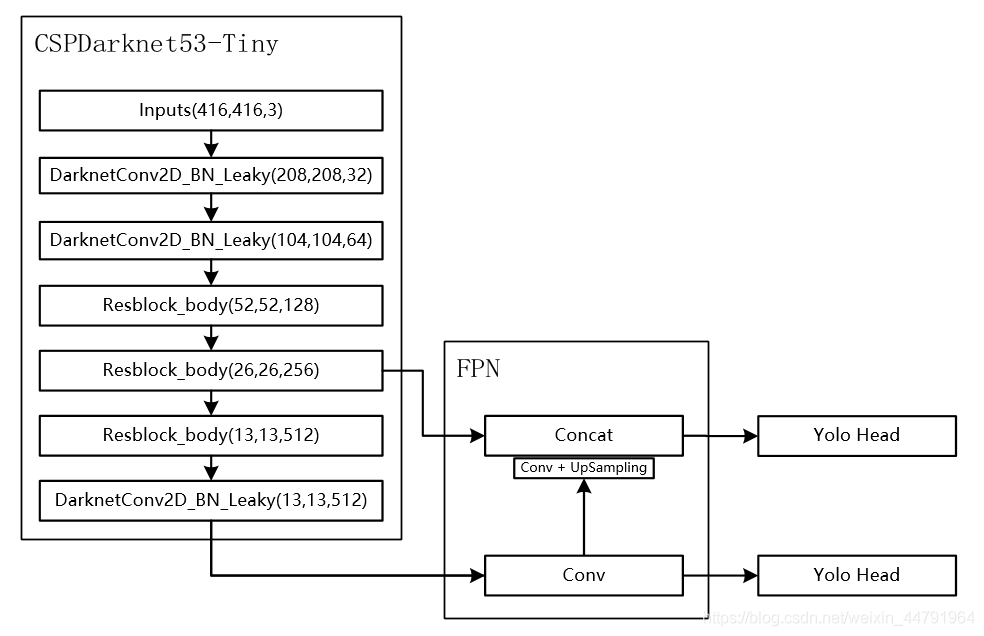
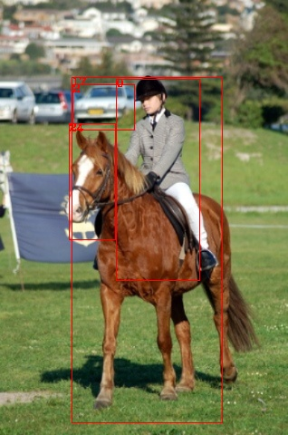
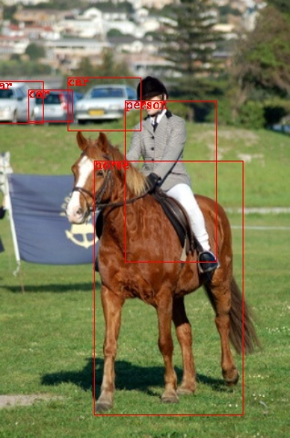

## 第七章 目标检测模型搭建，训练，预测
------


阅读本文需要有基础的pytorch编程经验，目标检测框架相关知识，不用很深入，大致了解概念即可。

本章简要介绍如何如何用C++实现一个目标检测器模型，该模型具有训练和预测的功能。本文的分割模型架构使用yolov4-tiny结构，代码结构参考了[bubbliiiing yolov4-tiny](https://github.com/bubbliiiing/yolov4-tiny-pytorch)，本文分享的c++模型几乎完美复现了pytorch的版本，且具有速度优势，30-40%的速度提升。

### 1.模型简介

简单介绍一下yolov4-tiny模型。yolov4-tiny模型是YOLO(you only look once)系列模型中，version 4的轻巧版，相比于yolov4，它牺牲了部分精度以实现速度上的大幅提升。yolov4_tiny模型结构如图（图片来源自这）：

<div align=center>
 
</div>
<br>


可以发现模型结构非常简单，以CSPDarknet53-tiny为骨干网络，FPN为颈部(neck)，Yolo head为头部。最后输出两个特征层，分别是原图下采样32倍和下采样16倍的特征图。训练时，以这两个特征图分别输入损失计算中计算损失，再将损失求和(或平均，怎么都好)，后做反向传播，预测时将两个特征图解码出的结果做并集再做NMS(非极大值抑制)。

### 2.骨干网络

CSPDarknet53-tiny是[CSPNet](https://arxiv.org/pdf/1911.11929.pdf)的一种，CSPNet发表于CVPR2019，是用于提升目标检测模型检测性能的一种骨干网络,但对于分类效果提升有限，但在速度上有提升。感兴趣的同学可以去看原文，简单理解该论文贡献，就是将特征层沿着通道维度切成两片，两片分别做不同的卷积，然后再拼接起来，这样做相比于直接对原图做特征提取，能减少计算量。

默认看过我的libtorch系列教程的前部分,直接上代码。首先是基本单元，由Conv2d + BatchNorm2d + LeakyReLU构成。

```c++

//Conv2d + BatchNorm2d + LeakyReLU
class BasicConvImpl : public torch::nn::Module {
public:
    BasicConvImpl(int in_channels, int out_channels, int kernel_size, int stride = 1);
    torch::Tensor forward(torch::Tensor x);
private:
    // Declare layers
    torch::nn::Conv2d conv{ nullptr };
    torch::nn::BatchNorm2d bn{ nullptr };
    torch::nn::LeakyReLU acitivation{ nullptr };
}; TORCH_MODULE(BasicConv);

BasicConvImpl::BasicConvImpl(int in_channels, int out_channels, int kernel_size, 
    int stride) :
    conv(conv_options(in_channels, out_channels, kernel_size, stride, 
        int(kernel_size / 2), 1, false)),
    bn(torch::nn::BatchNorm2d(out_channels)),
    acitivation(torch::nn::LeakyReLU(torch::nn::LeakyReLUOptions().negative_slope(0.1)))
{
    register_module("conv", conv);
    register_module("bn", bn);
}

torch::Tensor BasicConvImpl::forward(torch::Tensor x)
{
    x = conv->forward(x);
    x = bn->forward(x);
    x = acitivation(x);
    return x;
}

```

该层作为基本模块，将在后期作为搭积木的基本块，搭建yolo4_tiny。

然后是Resblock_body模块，

```c++

class Resblock_bodyImpl : public torch::nn::Module {
public:
    Resblock_bodyImpl(int in_channels, int out_channels);
    std::vector<torch::Tensor> forward(torch::Tensor x);
private:
    int out_channels;
    BasicConv conv1{ nullptr };
    BasicConv conv2{ nullptr };
    BasicConv conv3{ nullptr };
    BasicConv conv4{ nullptr };
    torch::nn::MaxPool2d maxpool{ nullptr };
}; TORCH_MODULE(Resblock_body);

Resblock_bodyImpl::Resblock_bodyImpl(int in_channels, int out_channels) {
    this->out_channels = out_channels;
    conv1 = BasicConv(in_channels, out_channels, 3);
    conv2 = BasicConv(out_channels / 2, out_channels / 2, 3);
    conv3 = BasicConv(out_channels / 2, out_channels / 2, 3);
    conv4 = BasicConv(out_channels, out_channels, 1);
    maxpool = torch::nn::MaxPool2d(maxpool_options(2, 2));

    register_module("conv1", conv1);
    register_module("conv2", conv2);
    register_module("conv3", conv3);
    register_module("conv4", conv4);

}
std::vector<torch::Tensor> Resblock_bodyImpl::forward(torch::Tensor x) {
    auto c = out_channels;
    x = conv1->forward(x);
    auto route = x;

    x = torch::split(x, c / 2, 1)[1];
    x = conv2->forward(x);
    auto route1 = x;

    x = conv3->forward(x);
    x = torch::cat({ x, route1 }, 1);
    x = conv4->forward(x);
    auto feat = x;

    x = torch::cat({ route, x }, 1);
    x = maxpool->forward(x);
    return std::vector<torch::Tensor>({ x,feat });
}

```

最后是骨干网络主体

```c++

class CSPdarknet53_tinyImpl : public torch::nn::Module
{
public:
    CSPdarknet53_tinyImpl();
    std::vector<torch::Tensor> forward(torch::Tensor x);
private:
    BasicConv conv1{ nullptr };
    BasicConv conv2{ nullptr };
    Resblock_body resblock_body1{ nullptr };
    Resblock_body resblock_body2{ nullptr };
    Resblock_body resblock_body3{ nullptr };
    BasicConv conv3{ nullptr };
    int num_features = 1;
}; TORCH_MODULE(CSPdarknet53_tiny);

CSPdarknet53_tinyImpl::CSPdarknet53_tinyImpl() {
    conv1 = BasicConv(3, 32, 3, 2);
    conv2 = BasicConv(32, 64, 3, 2);
    resblock_body1 = Resblock_body(64, 64);
    resblock_body2 = Resblock_body(128, 128);
    resblock_body3 = Resblock_body(256, 256);
    conv3 = BasicConv(512, 512, 3);

    register_module("conv1", conv1);
    register_module("conv2", conv2);
    register_module("resblock_body1", resblock_body1);
    register_module("resblock_body2", resblock_body2);
    register_module("resblock_body3", resblock_body3);
    register_module("conv3", conv3);
}

std::vector<torch::Tensor> CSPdarknet53_tinyImpl::forward(torch::Tensor x) {
    // 416, 416, 3 -> 208, 208, 32 -> 104, 104, 64
    x = conv1(x);
    x = conv2(x);

    // 104, 104, 64 -> 52, 52, 128
    x = resblock_body1->forward(x)[0];
    // 52, 52, 128 -> 26, 26, 256
    x = resblock_body2->forward(x)[0];
    // 26, 26, 256->xΪ13, 13, 512
#   //        -> feat1Ϊ26,26,256
    auto res_out = resblock_body3->forward(x);
    x = res_out[0];
    auto feat1 = res_out[1];
    // 13, 13, 512 -> 13, 13, 512
    x = conv3->forward(x);
    auto feat2 = x;
    return std::vector<torch::Tensor>({ feat1, feat2 });
}


```

至此，yolo4_tiny中的骨干网络已经搭建好。接下来将搭建yolo4_tiny模型。

### 3.yolov4_tiny

骨干网络得到的特征图，将经过FPN，需要上采样模块。

```c++
//conv+upsample
class UpsampleImpl : public torch::nn::Module {
public:
    UpsampleImpl(int in_channels, int out_channels);
    torch::Tensor forward(torch::Tensor x);
private:
    // Declare layers
    torch::nn::Sequential upsample = torch::nn::Sequential();
}; TORCH_MODULE(Upsample);

UpsampleImpl::UpsampleImpl(int in_channels, int out_channels)
{
    upsample = torch::nn::Sequential(
        BasicConv(in_channels, out_channels, 1)
        //torch::nn::Upsample(torch::nn::UpsampleOptions().scale_factor(std::vector<double>({ 2 })).mode(torch::kNearest).align_corners(false))
    );
    register_module("upsample", upsample);
}

torch::Tensor UpsampleImpl::forward(torch::Tensor x)
{
    x = upsample->forward(x);
    x = at::upsample_nearest2d(x, { x.sizes()[2] * 2 , x.sizes()[3] * 2 });
    return x;
}
```

然后是yolo_head模块

```c++
torch::nn::Sequential yolo_head(std::vector<int> filters_list, int in_filters);

torch::nn::Sequential yolo_head(std::vector<int> filters_list, int in_filters) {
    auto m = torch::nn::Sequential(BasicConv(in_filters, filters_list[0], 3),
        torch::nn::Conv2d(conv_options(filters_list[0], filters_list[1], 1)));
    return m;
}
```

以及yolo_body

```c++
class YoloBody_tinyImpl : public torch::nn::Module {
public:
    YoloBody_tinyImpl(int num_anchors, int num_classes);
    std::vector<torch::Tensor> forward(torch::Tensor x);
private:
    // Declare layers
    CSPdarknet53_tiny backbone{ nullptr };
    BasicConv conv_for_P5{ nullptr };
    Upsample upsample{ nullptr };
    torch::nn::Sequential yolo_headP5{ nullptr };
    torch::nn::Sequential yolo_headP4{ nullptr };
}; TORCH_MODULE(YoloBody_tiny);

YoloBody_tinyImpl::YoloBody_tinyImpl(int num_anchors, int num_classes) {
    backbone = CSPdarknet53_tiny();
    conv_for_P5 = BasicConv(512, 256, 1);
    yolo_headP5 = yolo_head({ 512, num_anchors * (5 + num_classes) }, 256);
    upsample = Upsample(256, 128);
    yolo_headP4 = yolo_head({ 256, num_anchors * (5 + num_classes) }, 384);

    register_module("backbone", backbone);
    register_module("conv_for_P5", conv_for_P5);
    register_module("yolo_headP5", yolo_headP5);
    register_module("upsample", upsample);
    register_module("yolo_headP4", yolo_headP4);
}
std::vector<torch::Tensor> YoloBody_tinyImpl::forward(torch::Tensor x) {
    //return feat1 with shape of {26,26,256} and feat2 of {13, 13, 512}
    auto backbone_out = backbone->forward(x);
    auto feat1 = backbone_out[0];
    auto feat2 = backbone_out[1];
    //13,13,512 -> 13,13,256
    auto P5 = conv_for_P5->forward(feat2);
    //13, 13, 256 -> 13, 13, 512 -> 13, 13, 255
    auto out0 = yolo_headP5->forward(P5);


    //13,13,256 -> 13,13,128 -> 26,26,128
    auto P5_Upsample = upsample->forward(P5);
    //26, 26, 256 + 26, 26, 128 -> 26, 26, 384
    auto P4 = torch::cat({ P5_Upsample, feat1 }, 1);
    //26, 26, 384 -> 26, 26, 256 -> 26, 26, 255
    auto out1 = yolo_headP4->forward(P4);
    return std::vector<torch::Tensor>({ out0, out1 });
}
```

代码写到这一步，其实只要细心就会发现基本是对pytorch代码到libtorch的迁移，除了少数bug需要调试，大部分简单迁移到c++即可。可以说是非常简便了。

像前面章节中一样，生成torchscript模型。bubbliiiing yolov4-tiny中有提供一个coco训练版本，通过下述代码生成.pt文件：

```python
import torch
from torchsummary import summary
import numpy as np

from nets.yolo4_tiny import YoloBody
from train import get_anchors, get_classes,YOLOLoss

device = torch.device('cpu')
model = YoloBody(3,80).to(device)
model_path = "model_data/yolov4_tiny_weights_coco.pth"

print('Loading weights into state dict...')
model_dict = model.state_dict()
pretrained_dict = torch.load(model_path, map_location=torch.device("cpu"))
pretrained_dict = {k: v for k, v in pretrained_dict.items() if np.shape(model_dict[k]) ==  np.shape(v)}
model_dict.update(pretrained_dict)
model.load_state_dict(model_dict)
print('Finished!')

#生成pt模型，按照官网来即可
model=model.to(torch.device("cpu"))
model.eval()
var=torch.ones((1,3,416,416))
traced_script_module = torch.jit.trace(model, var)
traced_script_module.save("yolo4_tiny.pt")
```

然后在c++中使用下述代码测试是否能够正确加载:

```c++

auto model = YoloBody_tiny(3, 80);
torch::load(model, "weights/yolo4_tiny.pt");

```

执行通过即表明加载成功。


### 4.预测

预测需要将YOLO4_tiny模型输出的张量进行解码，根据源代码解码函数，写出c++版本的解码函数，此时将发现，libtorch教程第二章的重要性了。

```c++

torch::Tensor DecodeBox(torch::Tensor input, torch::Tensor anchors, int num_classes, int img_size[])
{
    int num_anchors = anchors.sizes()[0];
    int bbox_attrs = 5 + num_classes;
    int batch_size = input.sizes()[0];
    int input_height = input.sizes()[2];
    int input_width = input.sizes()[3];
    //计算步长
    //每一个特征点对应原来的图片上多少个像素点
    //如果特征层为13x13的话，一个特征点就对应原来的图片上的32个像素点
    //416 / 13 = 32
    auto stride_h = img_size[1] / input_height;
    auto stride_w = img_size[0] / input_width;
    //把先验框的尺寸调整成特征层大小的形式
    //计算出先验框在特征层上对应的宽高
    auto scaled_anchors = anchors.clone();
    scaled_anchors.select(1, 0) = scaled_anchors.select(1, 0) / stride_w;
    scaled_anchors.select(1, 1) = scaled_anchors.select(1, 1) / stride_h;

    //bs, 3 * (5 + num_classes), 13, 13->bs, 3, 13, 13, (5 + num_classes)
    //cout << "begin view"<<input.sizes()<<endl;
    auto prediction = input.view({ batch_size, num_anchors,bbox_attrs, input_height, input_width }).permute({ 0, 1, 3, 4, 2 }).contiguous();
    //cout << "end view" << endl;
    //先验框的中心位置的调整参数
    auto x = torch::sigmoid(prediction.select(-1, 0));
    auto y = torch::sigmoid(prediction.select(-1, 1));
    //先验框的宽高调整参数
    auto w = prediction.select(-1, 2); // Width
    auto h = prediction.select(-1, 3); // Height

    //获得置信度，是否有物体
    auto conf = torch::sigmoid(prediction.select(-1, 4));
    //种类置信度
    auto pred_cls = torch::sigmoid(prediction.narrow(-1, 5, num_classes));// Cls pred.

    auto LongType = x.clone().to(torch::kLong).options();
    auto FloatType = x.options();

    //生成网格，先验框中心，网格左上角 batch_size, 3, 13, 13
    auto grid_x = torch::linspace(0, input_width - 1, input_width).repeat({ input_height, 1 }).repeat(
        { batch_size * num_anchors, 1, 1 }).view(x.sizes()).to(FloatType);
    auto grid_y = torch::linspace(0, input_height - 1, input_height).repeat({ input_width, 1 }).t().repeat(
        { batch_size * num_anchors, 1, 1 }).view(y.sizes()).to(FloatType);

    //生成先验框的宽高
    auto anchor_w = scaled_anchors.to(FloatType).narrow(1, 0, 1);
    auto anchor_h = scaled_anchors.to(FloatType).narrow(1, 1, 1);
    anchor_w = anchor_w.repeat({ batch_size, 1 }).repeat({ 1, 1, input_height * input_width }).view(w.sizes());
    anchor_h = anchor_h.repeat({ batch_size, 1 }).repeat({ 1, 1, input_height * input_width }).view(h.sizes());

    //计算调整后的先验框中心与宽高
    auto pred_boxes = torch::randn_like(prediction.narrow(-1, 0, 4)).to(FloatType);
    pred_boxes.select(-1, 0) = x + grid_x;
    pred_boxes.select(-1, 1) = y + grid_y;
    pred_boxes.select(-1, 2) = w.exp() * anchor_w;
    pred_boxes.select(-1, 3) = h.exp() * anchor_h;

    //用于将输出调整为相对于416x416的大小
    std::vector<int> scales{ stride_w, stride_h, stride_w, stride_h };
    auto _scale = torch::tensor(scales).to(FloatType);
    //cout << pred_boxes << endl;
    //cout << conf << endl;
    //cout << pred_cls << endl;
    pred_boxes = pred_boxes.view({ batch_size, -1, 4 }) * _scale;
    conf = conf.view({ batch_size, -1, 1 });
    pred_cls = pred_cls.view({ batch_size, -1, num_classes });
    auto output = torch::cat({ pred_boxes, conf, pred_cls }, -1);
    return output;
}

```

此外，还需要将输出进行非极大值抑制。参考我的[NMS的几种写法](https://allentdan.github.io/2020/12/24/NMS%E7%9A%84%E5%87%A0%E7%A7%8D%E5%86%99%E6%B3%95/)写出非极大值抑制函数：

```c++
std::vector<int> nms_libtorch(torch::Tensor bboxes, torch::Tensor scores, float thresh) {
    auto x1 = bboxes.select(-1, 0);
    auto y1 = bboxes.select(-1, 1);
    auto x2 = bboxes.select(-1, 2);
    auto y2 = bboxes.select(-1, 3);
    auto areas = (x2 - x1)*(y2 - y1);   //[N, ] 每个bbox的面积
    auto tuple_sorted = scores.sort(0, true);    //降序排列
    auto order = std::get<1>(tuple_sorted);

    std::vector<int>    keep;
    while (order.numel() > 0) {// torch.numel()返回张量元素个数
        if (order.numel() == 1) {//    保留框只剩一个
            auto i = order.item();
            keep.push_back(i.toInt());
            break;
        }
        else {
            auto i = order[0].item();// 保留scores最大的那个框box[i]
            keep.push_back(i.toInt());
        }
        //计算box[i]与其余各框的IOU(思路很好)
        auto order_mask = order.narrow(0, 1, order.size(-1) - 1);
        x1.index({ order_mask });
        x1.index({ order_mask }).clamp(x1[keep.back()].item().toFloat(), 1e10);
        auto xx1 = x1.index({ order_mask }).clamp(x1[keep.back()].item().toFloat(), 1e10);// [N - 1, ]
        auto yy1 = y1.index({ order_mask }).clamp(y1[keep.back()].item().toFloat(), 1e10);
        auto xx2 = x2.index({ order_mask }).clamp(0, x2[keep.back()].item().toFloat());
        auto yy2 = y2.index({ order_mask }).clamp(0, y2[keep.back()].item().toFloat());
        auto inter = (xx2 - xx1).clamp(0, 1e10) * (yy2 - yy1).clamp(0, 1e10);// [N - 1, ]

        auto iou = inter / (areas[keep.back()] + areas.index({ order.narrow(0,1,order.size(-1) - 1) }) - inter);//[N - 1, ]
        auto idx = (iou <= thresh).nonzero().squeeze();//注意此时idx为[N - 1, ] 而order为[N, ]
        if (idx.numel() == 0) {
            break;
        }
        order = order.index({ idx + 1 }); //修补索引之间的差值
    }
    return keep;
}

std::vector<torch::Tensor> non_maximum_suppression(torch::Tensor prediction, int num_classes, float conf_thres, float nms_thres) {

    prediction.select(-1, 0) -= prediction.select(-1, 2) / 2;
    prediction.select(-1, 1) -= prediction.select(-1, 3) / 2;
    prediction.select(-1, 2) += prediction.select(-1, 0);
    prediction.select(-1, 3) += prediction.select(-1, 1);

    std::vector<torch::Tensor> output;
    for (int image_id = 0; image_id < prediction.sizes()[0]; image_id++) {
        auto image_pred = prediction[image_id];
        auto max_out_tuple = torch::max(image_pred.narrow(-1, 5, num_classes), -1, true);
        auto class_conf = std::get<0>(max_out_tuple);
        auto class_pred = std::get<1>(max_out_tuple);
        auto conf_mask = (image_pred.select(-1, 4) * class_conf.select(-1, 0) >= conf_thres).squeeze();
        image_pred = image_pred.index({ conf_mask }).to(torch::kFloat);
        class_conf = class_conf.index({ conf_mask }).to(torch::kFloat);
        class_pred = class_pred.index({ conf_mask }).to(torch::kFloat);

        if (!image_pred.sizes()[0]) {
            output.push_back(torch::full({ 1, 7 }, 0));
            continue;
        }

        //获得的内容为(x1, y1, x2, y2, obj_conf, class_conf, class_pred)
        auto detections = torch::cat({ image_pred.narrow(-1,0,5), class_conf, class_pred }, 1);
        //获得种类
        std::vector<torch::Tensor> img_classes;

        for (int m = 0, len = detections.size(0); m < len; m++)
        {
            bool found = false;
            for (size_t n = 0; n < img_classes.size(); n++)
            {
                auto ret = (detections[m][6] == img_classes[n]);
                if (torch::nonzero(ret).size(0) > 0)
                {
                    found = true;
                    break;
                }
            }
            if (!found) img_classes.push_back(detections[m][6]);
        }
        std::vector<torch::Tensor> temp_class_detections;
        for (auto c : img_classes) {
            auto detections_class = detections.index({ detections.select(-1,-1) == c });
            auto keep = nms_libtorch(detections_class.narrow(-1, 0, 4), detections_class.select(-1, 4)*detections_class.select(-1, 5), nms_thres);
            std::vector<torch::Tensor> temp_max_detections;
            for (auto v : keep) {
                temp_max_detections.push_back(detections_class[v]);
            }
            auto max_detections = torch::cat(temp_max_detections, 0);
            temp_class_detections.push_back(max_detections);
        }
        auto class_detections = torch::cat(temp_class_detections, 0);
        output.push_back(class_detections);
    }
    return output;
}
```

这些函数准备好后，写出预测函数：

```c++

void show_bbox_coco(cv::Mat image, torch::Tensor bboxes, int nums) {
    //设置绘制文本的相关参数
    int font_face = cv::FONT_HERSHEY_COMPLEX;
    double font_scale = 0.4;
    int thickness = 1;
    float* bbox = new float[bboxes.size(0)]();
    std::cout << bboxes << std::endl;
    memcpy(bbox, bboxes.cpu().data_ptr(), bboxes.size(0) * sizeof(float));
    for (int i = 0; i < bboxes.size(0); i = i + 7)
    {
        cv::rectangle(image, cv::Rect(bbox[i + 0], bbox[i + 1], bbox[i + 2] - bbox[i + 0], bbox[i + 3] - bbox[i + 1]), cv::Scalar(0, 0, 255));
        //将文本框居中绘制
        cv::Point origin;
        origin.x = bbox[i + 0];
        origin.y = bbox[i + 1] + 8;
        cv::putText(image, std::to_string(int(bbox[i + 6])), origin, font_face, font_scale, cv::Scalar(0, 0, 255), thickness, 1, 0);
    }
    delete bbox;
    cv::imshow("test", image);
    cv::waitKey(0);
    cv::destroyAllWindows();
}

void Predict(YoloBody_tiny detector, cv::Mat image, bool show, float conf_thresh, float nms_thresh) {
    int origin_width = image.cols;
    int origin_height = image.rows;
    cv::resize(image, image, { 416,416 });
    auto img_tensor = torch::from_blob(image.data, { image.rows, image.cols, 3 }, torch::kByte);
    img_tensor = img_tensor.permute({ 2, 0, 1 }).unsqueeze(0).to(torch::kFloat) / 255.0;

    float anchor[12] = { 10,14,  23,27,  37,58,  81,82,  135,169,  344,319 };
    auto anchors_ = torch::from_blob(anchor, { 6,2 }, torch::TensorOptions(torch::kFloat32));
    int image_size[2] = { 416,416 };
    img_tensor = img_tensor.cuda();

    auto outputs = detector->forward(img_tensor);
    std::vector<torch::Tensor> output_list = {};
    auto tensor_input = outputs[1];
    auto output_decoded = DecodeBox(tensor_input, anchors_.narrow(0, 0, 3), 80, image_size);
    output_list.push_back(output_decoded);

    tensor_input = outputs[0];
    output_decoded = DecodeBox(tensor_input, anchors_.narrow(0, 3, 3), 80, image_size);
    output_list.push_back(output_decoded);

    //std::cout << tensor_input << anchors_.narrow(0, 3, 3);

    auto output = torch::cat(output_list, 1);
    auto detection = non_maximum_suppression(output, 80, conf_thresh, nms_thresh);

    float w_scale = float(origin_width) / 416;
    float h_scale = float(origin_height) / 416;
    for (int i = 0; i < detection.size(); i++) {
        for (int j = 0; j < detection[i].size(0) / 7; j++)
        {
            detection[i].select(0, 7 * j + 0) *= w_scale;
            detection[i].select(0, 7 * j + 1) *= h_scale;
            detection[i].select(0, 7 * j + 2) *= w_scale;
            detection[i].select(0, 7 * j + 3) *= h_scale;
        }
    }

    cv::resize(image, image, { origin_width,origin_height });
    if (show)
        show_bbox_coco(image, detection[0], 80);
    return;
}


```

使用VOC数据集中一张图片，测试一下函数准确性。直接将上述代码用于测试.pt文件，如输入下述代码：

```c++

cv::Mat image = cv::imread("2007_005331.jpg");
auto model = YoloBody_tiny(3, 80);
torch::load(model, "weights/yolo4_tiny.pt");
model->to(torch::kCUDA);
Predict(model, image, true, 0.1, 0.3);

```

使用的图片如下图

<div align=center>
 
</div>

将会发现，预测结果如下：

<div align=center>
 
</div>

结果分析有以下两点结论：

+ 输出了检测框，预测函数大概率正确；
+ 存在部分误检，提高置信度阈值可能改善，但是会漏检。这是由于.pt文件训练时采用的预处理策略，和本文代码预测时采用的预处理策略不一致导致的。

使用训练和预测一致的预处理方式处理图片，得到的结果应该要好很多。下面时一张，以coco预训练权重做迁移学习，只训练yolo_head，训练voc数据集一个周期后，预测该图的效果：

<div align=center>
 
</div>

继续训练，数据增强，训练全部权重应该可以将结果提升更多。

### 5.训练

训练代码比较多，博客就不再介绍。可以移步到[LibtorchTutorials](https://github.com/AllentDan/LibtorchTutorials)中。同时，LibtorchTutorials中的代码实现的功能都比较基础，我将分开在LibtorchSegment项目和LibtorchDetection中将功能提升完善。有帮助到的话请点个star资瓷下。