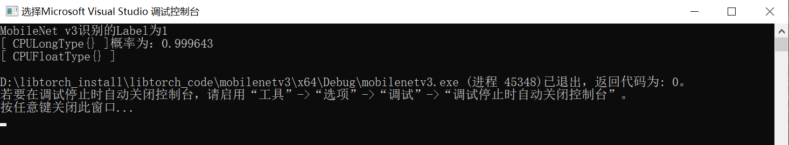
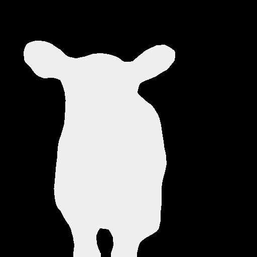
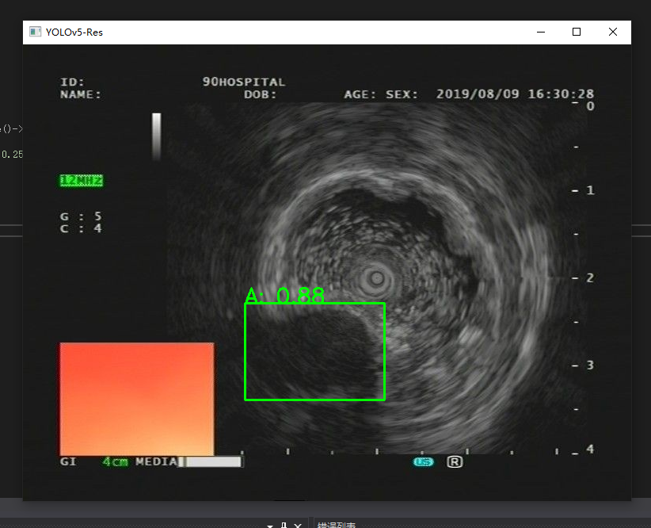

## 第8章 libtorch部署例子

------

### 1.图像分类的例子 MobileNet v3 

关于MobileNet V3可以参考<https://github.com/DataXujing/MobileNet_V3_pytorch>

+ 首先将训练好的模型转torchscript

```python

from __future__ import print_function, division
import os
import torch
from torch import nn,optim
import torch.nn.functional as F
import pandas as pd                 
import numpy as np
from torch.utils.data import Dataset, DataLoader
from torchvision import transforms, utils


import torch
from mobilenetv3 import *  # model
from data_pro import *
import cv2


#----------------model define-----------------
model = mobilenetv3(n_class=2, input_size=224, mode='large')
state_dict = torch.load("./checkpoint/20201111/MobileNet_v3_20201111_300_0.9659863945578231.pth")
model.load_state_dict(state_dict)
model.to(torch.device("cpu"))
model.eval()

# ----------------------------------------
var=torch.ones((1,3,224,224))
traced_script_module = torch.jit.trace(model, var)
traced_script_module.save("MobileNet_v3_large.pt")


```

+ libtorch调用模型识别

```c++
// mobilenetv3.cpp 

#include <torch/torch.h>
#include <torch/script.h> 
#include <opencv2/opencv.hpp>

#include <iostream>

using namespace cv;
using namespace std;

int main()
{
    //定义使用cuda
    //auto device = torch::Device(torch::kCUDA, 0);
    //读取图片

    vector<float> m = { 0.485, 0.456, 0.406 };
    vector<float> v = { 0.229, 0.224, 0.225 };

    auto mean = torch::from_blob(m.data(), { 1,3 }, torch::kFloat32);
    auto var = torch::from_blob(v.data(), { 1,3 }, torch::kFloat32);

    auto image = cv::imread(".\\test.jpg");

    //缩放至指定大小
    cv::resize(image, image, cv::Size(224, 224));
    //转成张量
    auto input_tensor = torch::from_blob(image.data, { image.rows, image.cols, 3 }, torch::kByte).permute({ 2, 0, 1 }).unsqueeze(0).to(torch::kFloat32) / 225.0;
    //auto input_tensor_norm = (input_tensor - mean) / var;

    //加载模型
    auto model = torch::jit::load(".\\model\\MobileNet_v3_large.pt");
    //model.to(device);
    model.eval();
    //前向传播
    //auto output = model.forward({ input_tensor.to(device) }).toTensor();
    auto output = model.forward({ input_tensor }).toTensor();
    output = torch::softmax(output, 1);

    auto class_id = torch::argmax(output);
    auto prob = output.max();

    std::cout << "MobileNet v3识别的Label为" << class_id << "概率为：" << prob << std::endl;


    return 0;
}

```

<div align=center>
 
</div>

<div align=center>
 
</div>
<br>
<br>

### 2.语义分割的例子 DeepLab V3+

关于deeplab v3+的Pytorch版本的的实现我们参考了：<https://github.com/VainF/DeepLabV3Plus-Pytorch>

模型结构为:

<div align=center>
 
</div>
<br>

+ 下载预训练的模型，并将模型转为torchscipt

```python


import network
import utils
import os
import random
import argparse
import numpy as np

from torch.utils import data
from datasets import VOCSegmentation, Cityscapes
from utils import ext_transforms as et
from metrics import StreamSegMetrics

import torch
import torch.nn as nn
from utils.visualizer import Visualizer
from torchvision import transforms

import cv2
from PIL import Image
import matplotlib
import matplotlib.pyplot as plt

# model
# Set up model
model_map = {
    'deeplabv3_resnet50': network.deeplabv3_resnet50,
    'deeplabv3plus_resnet50': network.deeplabv3plus_resnet50,
    'deeplabv3_resnet101': network.deeplabv3_resnet101,
    'deeplabv3plus_resnet101': network.deeplabv3plus_resnet101,
    'deeplabv3_mobilenet': network.deeplabv3_mobilenet,
    'deeplabv3plus_mobilenet': network.deeplabv3plus_mobilenet
}


model = model_map['deeplabv3_resnet50'](num_classes=21, output_stride=16)
#network.convert_to_separable_conv(model.classifier)
#utils.set_bn_momentum(model.backbone, momentum=0.01)

model.load_state_dict( torch.load( "../best_deeplabv3_resnet50_voc_os16.pth",
    map_location='cpu' )['model_state']  )
model.eval()

# print(model)

val_transform = transforms.Compose([
    transforms.Resize( (512,512) ),
    transforms.ToTensor(),
    transforms.Normalize(mean=[0.485, 0.456, 0.406],
                    std=[0.229, 0.224, 0.225]),
])
image = Image.open("../../test.jpg").convert('RGB')
image = val_transform(image).unsqueeze(0)
outputs = model(image)
preds = outputs.max(1)[1].detach().cpu().numpy()

# model trace
traced_script_module = torch.jit.trace(model, image)
traced_script_module.save("deeplabv3.pt")

```

生成libtorch调用的模型`deeplabv3.pt`

+ 编写基于libtorch的模型推断方法

```c++

// deeplabv3plus.cpp : 

#include<opencv2/opencv.hpp>
#include <torch/torch.h>
#include <torch/script.h> 

#include <iostream>

int main()
{
 
    //定义使用cuda
    //auto device = torch::Device(torch::kCUDA, 0);

    //加载模型
    auto model = torch::jit::load(".\\model\\deeplabv3.pt");
    //model.to(device);
    model.eval();

    std::cout << "deeplab模型加载完毕！" << std::endl;

    //读取图片
    auto image = cv::imread(".\\23_image.png");
    //缩放至指定大小
    cv::resize(image, image, cv::Size(512, 512),cv::INTER_LINEAR);
    //转成张量
    auto input_tensor = torch::from_blob(image.data, { image.rows, image.cols, 3 }, torch::kByte).permute({ 2, 0, 1 }).unsqueeze(0).to(torch::kFloat32) / 225.0;

    // 张量的标准化
    // todo
    std::cout << input_tensor.sizes() << std::endl;
    std::vector<float> m = { 0.485, 0.456, 0.406 };
    std::vector<float> v = { 0.229, 0.224, 0.225 };
    auto mean = torch::from_blob(m.data(), { 1,3,1,1 }, torch::kFloat32);
    auto var = torch::from_blob(v.data(), { 1,3,1,1 }, torch::kFloat32);

    input_tensor = (input_tensor - mean) / var;


    //前向传播
    //auto output = model.forward({ input_tensor.to(device) }).toTensor();
    auto output = model.forward({ input_tensor }).toTensor();
    std::tuple<at::Tensor,at::Tensor> preds = torch::max(output, 1);
    
    std::cout << output.sizes() << std::endl;
    std::cout << std::get<0>(preds).sizes() << std::endl;

    // tensor to cvmat
    auto pred_img = std::get<1>(preds).mul(255).to(torch::kU8);

    cv::Mat imgbin(cv::Size(512,512), CV_8U, pred_img.data_ptr());
    cv::imwrite("seg_res.jpg", imgbin);

    cv::namedWindow("segment-result", 0);
    cv::imshow("segment-result", imgbin);
    cv::waitKey(0);

    return 0;
}


```

+ 测试结果展示

<div align=center>
 
</div>
<br>
<div align=center>
 
</div>
<br>

识别结果是正确的。


### 3.目标检测的例子 YOLOv5x

我们使用自训练的YOLOv5x 5.0版本的代码，详细的代码可以参考<https://github.com/ultralytics/yolov5>

+ 生成torchscript模型

```shell

python ./model/export.py --grid
```

<div align=center>
 
</div>
<br>

+ 前处理

```c++
// pre process
at::Tensor imagpro(std::string imgpath="./test.jpg") {

    //读取图片
    auto image = cv::imread(imgpath);
    //缩放至指定大小
    cv::resize(image, image, cv::Size(640, 640));
    cv::cvtColor(image, image, cv::COLOR_BGR2RGB);
    //转成张量

    at::Tensor imgTensor = torch::from_blob(image.data, { image.rows, image.cols,3 }, torch::kByte);
    imgTensor = imgTensor.permute({ 2,0,1 });
    imgTensor = imgTensor.toType(torch::kFloat);
    imgTensor = imgTensor.div(255);
    imgTensor = imgTensor.unsqueeze(0);

    return imgTensor;
}

```

+ 后处理

```c++

// post process: NMS 
std::vector<torch::Tensor> non_max_suppression(torch::Tensor preds, float score_thresh = 0.25, float iou_thresh = 0.45)
{
    std::vector<torch::Tensor> output;
    for (size_t i = 0; i < preds.sizes()[0]; ++i)
    {
        torch::Tensor pred = preds.select(0, i);

        // Filter by scores
        torch::Tensor scores = pred.select(1, 4) * std::get<0>(torch::max(pred.slice(1, 5, pred.sizes()[1]), 1));
        pred = torch::index_select(pred, 0, torch::nonzero(scores > score_thresh).select(1, 0));
        if (pred.sizes()[0] == 0) continue;

        // (center_x, center_y, w, h) to (left, top, right, bottom)
        pred.select(1, 0) = pred.select(1, 0) - pred.select(1, 2) / 2;
        pred.select(1, 1) = pred.select(1, 1) - pred.select(1, 3) / 2;
        pred.select(1, 2) = pred.select(1, 0) + pred.select(1, 2);
        pred.select(1, 3) = pred.select(1, 1) + pred.select(1, 3);

        // Computing scores and classes
        std::tuple<torch::Tensor, torch::Tensor> max_tuple = torch::max(pred.slice(1, 5, pred.sizes()[1]), 1);
        pred.select(1, 4) = pred.select(1, 4) * std::get<0>(max_tuple);
        pred.select(1, 5) = std::get<1>(max_tuple);

        torch::Tensor  dets = pred.slice(1, 0, 6);

        torch::Tensor keep = torch::empty({ dets.sizes()[0] });
        torch::Tensor areas = (dets.select(1, 3) - dets.select(1, 1)) * (dets.select(1, 2) - dets.select(1, 0));
        std::tuple<torch::Tensor, torch::Tensor> indexes_tuple = torch::sort(dets.select(1, 4), 0, 1);
        torch::Tensor v = std::get<0>(indexes_tuple);
        torch::Tensor indexes = std::get<1>(indexes_tuple);
        int count = 0;
        while (indexes.sizes()[0] > 0)
        {
            keep[count] = (indexes[0].item().toInt());
            count += 1;

            // Computing overlaps
            torch::Tensor lefts = torch::empty(indexes.sizes()[0] - 1);
            torch::Tensor tops = torch::empty(indexes.sizes()[0] - 1);
            torch::Tensor rights = torch::empty(indexes.sizes()[0] - 1);
            torch::Tensor bottoms = torch::empty(indexes.sizes()[0] - 1);
            torch::Tensor widths = torch::empty(indexes.sizes()[0] - 1);
            torch::Tensor heights = torch::empty(indexes.sizes()[0] - 1);
            for (size_t i = 0; i < indexes.sizes()[0] - 1; ++i)
            {
                lefts[i] = std::max(dets[indexes[0]][0].item().toFloat(), dets[indexes[i + 1]][0].item().toFloat());
                tops[i] = std::max(dets[indexes[0]][1].item().toFloat(), dets[indexes[i + 1]][1].item().toFloat());
                rights[i] = std::min(dets[indexes[0]][2].item().toFloat(), dets[indexes[i + 1]][2].item().toFloat());
                bottoms[i] = std::min(dets[indexes[0]][3].item().toFloat(), dets[indexes[i + 1]][3].item().toFloat());
                widths[i] = std::max(float(0), rights[i].item().toFloat() - lefts[i].item().toFloat());
                heights[i] = std::max(float(0), bottoms[i].item().toFloat() - tops[i].item().toFloat());
            }
            torch::Tensor overlaps = widths * heights;

            // FIlter by IOUs
            torch::Tensor ious = overlaps / (areas.select(0, indexes[0].item().toInt()) + torch::index_select(areas, 0, indexes.slice(0, 1, indexes.sizes()[0])) - overlaps);
            indexes = torch::index_select(indexes, 0, torch::nonzero(ious <= iou_thresh).select(1, 0) + 1);
        }
        keep = keep.toType(torch::kInt64);
        output.push_back(torch::index_select(dets, 0, keep.slice(0, 0, count)));
    }
    return output;

}

```

+ 可视化plot box

```c++

// plot box
void plotbox(std::vector<torch::Tensor> dets,cv::Mat image, std::vector<std::string> classnames) {

    if (dets.size() > 0)
    {
        // Visualize result
        for (size_t i = 0; i < dets[0].sizes()[0]; ++i)
        {
            float left = dets[0][i][0].item().toFloat() * image.cols / 640;
            float top = dets[0][i][1].item().toFloat() * image.rows / 640;
            float right = dets[0][i][2].item().toFloat() * image.cols / 640;
            float bottom = dets[0][i][3].item().toFloat() * image.rows / 640;
            float score = dets[0][i][4].item().toFloat();
            int classID = dets[0][i][5].item().toInt();

            cv::rectangle(image, cv::Rect(left, top, (right - left), (bottom - top)), cv::Scalar(0, 255, 0), 2);

            cv::putText(image,
                classnames[classID] + ": " + cv::format("%.2f", score),
                cv::Point(left, top),
                cv::FONT_HERSHEY_SIMPLEX, (right - left) / 200, cv::Scalar(0, 255, 0), 2);
        }
    }

    cv::imshow("YOLOv5-Res", image);
    cv::waitKey(0);

}

```


+ 主函数

```c++

int main()
{
    // eus
    // Loading  Model
    torch::jit::script::Module module = torch::jit::load("./model/best.torchscript.pt");
    std::cout << "[info] 模型加载完毕" << std::endl;

    //加载类别
    std::vector<std::string> classnames;
    std::ifstream f("./model/coco.names");
    std::string name = "";
    while (std::getline(f, name))
    {
        classnames.push_back(name);
    }

    std::cout << "[info] 类别名称: " << std::endl;
    std::cout << classnames << std::endl;

    // 前处理
    at::Tensor inputtensor = imagpro("./test.jpg");
    // yolov5 模型识别
    torch::Tensor preds = module.forward({ inputtensor }).toTuple()->elements()[0].toTensor();
    // 后处理
    std::vector<torch::Tensor> dets = non_max_suppression(preds, 0.25, 0.45);

    //plotbox
    cv::Mat image = cv::imread("./test.jpg");
    plotbox(dets, image, classnames);

    return 0;
}


```

识别结果

<div align=center>
 
</div>
<br>

可以看到识别是正常的！


综上，我们完成了计算机视觉中常用的分类，分割，检测网络的libtorch的C++部署。